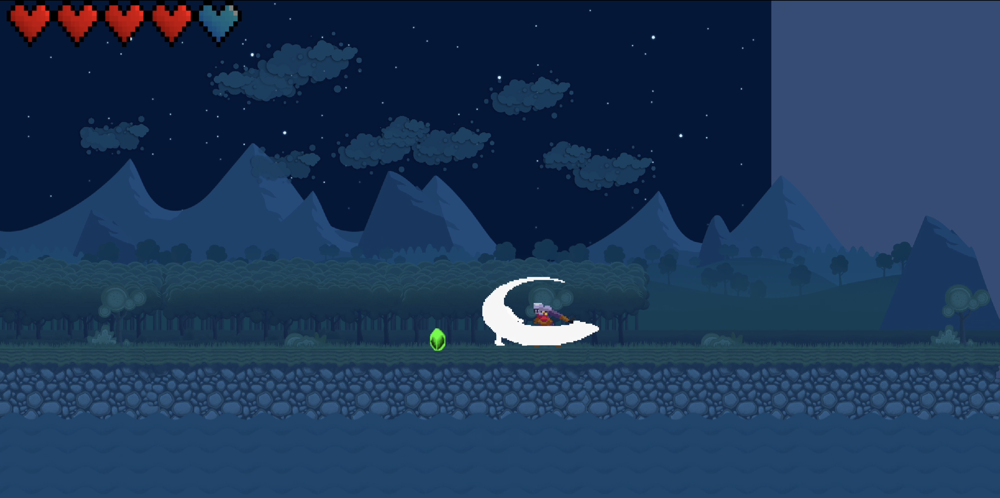

# Echoborne

## Overview
**Echoborne** is a 2D platformer game demo built in Unity. You play as a sound-based creature navigating a quiet forest world. The game is designed as a learning project to explore core game development mechanics, including movement, combat, UI, and item collection.

### 🎮 Demo Features
The current demo includes:
- A responsive **movement system** (running, jumping, turning)
- A basic **enemy encounter** with functional combat mechanics
- A **health UI** that tracks player damage
- A **loot system** where you can collect gems and interact with in-world items
- Basic **animations** for player, enemies, and effects

### 🔮 Future Scope
Planned features for future development:
- Multiple enemy types with unique AI patterns and combat styles
- Sound-based puzzles and echo-driven world interactions
- A level progression system with increasing complexity
- Expanded loot types and inventory system
- Boss fights with scripted mechanics and phase transitions
- Save/load functionality and game state persistence
- Full sound design including ambient music and feedback cues
- Additional environmental zones and level themes

---

## Development Process & Skills Learned

### 🔧 1. Project Setup & Tools
- Set up a Unity URP project from scratch with clean folder organization
- Learned to configure and use Unity's **Universal Render Pipeline**
- Integrated Unity's **new Input System** for more flexible control mapping

### 🎮 2. Core Game Mechanics
- **Player Movement**
  - Developed smooth horizontal movement with acceleration/deceleration
  - Implemented jump logic using Unity's physics engine
  - Created a responsive control system using `PlayerInput` and action maps

- **Combat System**
  - Built a **modular health system** using scriptable objects and components
  - Developed basic **enemy AI** for patrolling and reacting to the player
  - Scripted combat collisions and knockback effects

- **Item Collection**
  - Created a gem pickup system with **interface-based architecture (`IItem`)**
  - Implemented item tracking and visual/audio feedback on collection

### 🎨 3. Visuals & Animation
- Used pixel art assets for characters and environments
- Implemented 2D **animation controllers** and state transitions
- Set up forest levels with Unity **Tilemaps** and custom prefabs

### 🧩 4. UI/UX
- Designed a health bar UI using **TextMesh Pro**
- Synced UI updates with gameplay events using **event-driven programming**
- Integrated feedback animations (e.g., damage flash, death animation)

---

## 🧠 Technical & Design Concepts I Learned

### 🧰 Unity-Specific Skills
- URP lighting and rendering setup
- New Input System (actions, bindings, and callbacks)
- Animator state machines for characters and UI
- Prefabs, nesting, and reusable object architecture
- Scene organization and transition setup

### 💻 Programming Patterns
- **Component-based design** (encapsulation and reusability)
- **Interface-based scripting** for extensibility (`IItem`)
- Event-driven architecture (`UnityEvent`, `OnTriggerEnter`)
- Finite state machine logic for AI
- Custom physics and player movement scripting

### 🎮 Game Design Principles
- Moment-to-moment gameplay polish
- Feedback loops and visual communication
- Simple AI and patrol behaviors
- Introductory level layout with pacing in mind
- Health, damage, and respawn mechanics

---

## 📁 Assets Used

- **Hero Knight** character (animated sprites)
- **2D Bandits** Pixel Art Pack
- **2D Forest Tileset Pack – Toon Style**
- **2D Pixel Item Pack** (hearts, gems)
- **TextMesh Pro** (UI elements)

---

## 🔮 Future Goals
- Implement sound-based puzzle mechanics (thematic core)
- Add multiple enemy types with unique behaviors
- Introduce a scoring and combo system
- Build multiple forest-themed levels
- Add sound effects, music, and audio cues
- Implement save/load functionality
- Polish visual effects and game feel

---

## 🧪 Development Environment

- Unity Version: Unity 6.1
- Platform: macOS (Silicon)
- Target Build: WebGL & Windows (PC)

---

## 🙋‍♂️ Credits

- Developed by **Amir Valizadeh**
- Assets from:
  - [Hero Knight 2](https://assetstore.unity.com/packages/2d/characters/hero-knight-2-168019)
  - [2D Forest Tileset Toon Style](https://assetstore.unity.com/packages/2d/environments/2d-forest-tileset-pack-toon-style-93499)
  - [2D Pixel Item Pack](https://assetstore.unity.com/packages/2d/gui/icons/2d-pixel-item-asset-pack-99645)
  - [Pixel Art Gem Pack - Animated](https://assetstore.unity.com/packages/2d/environments/pixel-art-gem-pack-animated-277559)
  - [Bandits - Pixel Art](https://assetstore.unity.com/packages/2d/characters/bandits-pixel-art-104130)

---

## 📄 License

This project is for educational and personal use. Assets are credited to their original authors.  
License: [MIT License](https://www.mit.edu/~amini/LICENSE.md)
